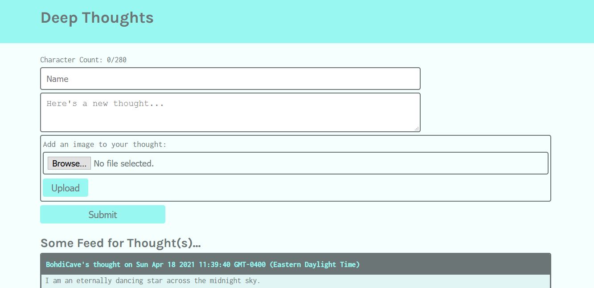
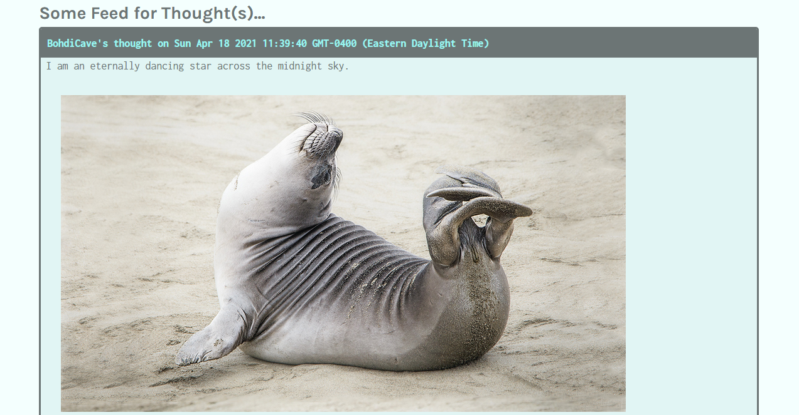

# AWS-thought - a record of deep thoughts

AWS-deployed journaling app - an exercise in setting up and deploying a React-Express-Node.js app to Amazon Linux EC2 instance, using S3 bucket for storage and DynamoDB for backend data processing. 

## Technology stack

* Frontend: React.js
  * react-dom - for accessing the virtual DOM in React
  * react-router-dom - for routing inside the app
  * react-scripts - for running React scripts in dev and deployment
* Backend: Express.js, Node.js
  * npm packages:
    * asw-sdk - for developing an AWS-compatible app
    * multer - for file upload
    * pm2 - for managing the app on AWS
    * uuid - for assigning universal identifiers
    * jwt-decode - for JSON web token authentication
    * dotenv - for setting up environmental variables
* AWS Cloud:
  * S3 bucket for images upload and storage
  * DynamoDB for data persistence
  * EC2 instance for app deployment
  * AIM authentication
  * SSH setup of Amazon Linux core using Nginx

## Screenshots

